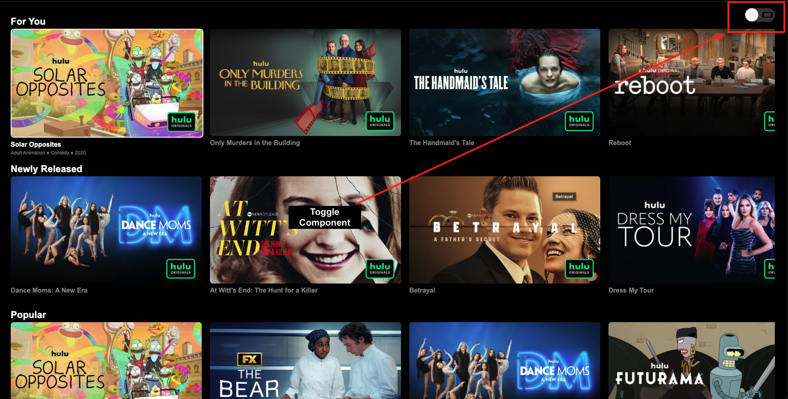
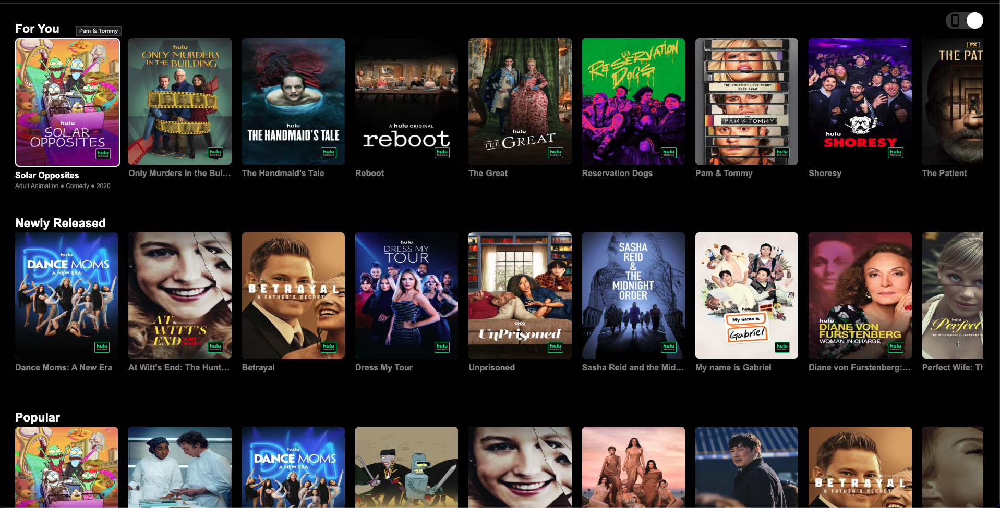
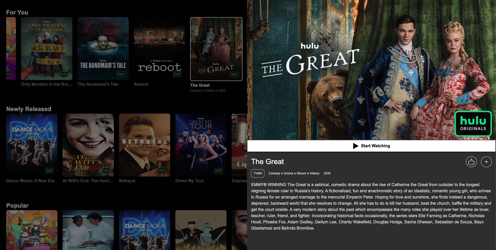

# Hulu Take-Home Assignment

First and foremost, I want to thank the team and the hiring manager for this opportunity. This assignment allowed me to revisit vanilla JavaScript implementation, and it was an enjoyable journey to refine my core JS skills.

My goal was to meet all the requirements while addressing most of the extra credit items within a shorter-than-average timeframe. While I was unable to implement **dynamic collection fetching as the user scrolls closer to the viewport**, this leaves room for improvement, which could be discussed in a future meeting (if applicable).

---

## Demo

[Click here to view the demo](https://akoushke.github.io/hulu/)

### **Horizontal Layout**

### **Vertical Layout**

### **Entity Details**

---

## Technology

As per the requirements, no third-party frameworks or libraries were used. Instead, I leveraged **native browser-supported features** to build the application. Specifically, I utilized **Web Components** (custom elements), as they provide a maintainable, modular, and reusable approach.

### **Why Web Components?**

- **Maintainability**: A clean separation of concerns, making components self-contained.
- **Reusability**: Components like the **Tile View** and **Modal** leverage the same **Image** component.
- **Native Browser Support**: Ensures lightweight, dependency-free execution.

A look at the `package.json` file will show **no dependencies** other than **development dependencies** for Webpack (build/runtime). The project solely utilizes **HTML, TypeScript, and CSS**.

---

## Features

1. **Navigation** – Users can navigate tiles both **vertically** and **horizontally** using the keyboard.
2. **Smooth Loading Experience** – A **shimmer effect** provides feedback before images fully load.
3. **Layout Flexibility** – Users can toggle between **horizontal and vertical tile layouts**.
4. **Watermark Support** – Some tiles include **branding/watermarks** based on API data.
5. **Smooth Transitions** – Selecting a tile smoothly transitions to a **detailed modal view**.
6. **Hulu Magic Load Time** – **All collections and tiles are preloaded at the start** to ensure instant navigation.
7. **Thorough Accessibility (A11Y)** – Accessibility is a **critical** part of this use case.
   - **Followed WCAG (Web Content Accessibility Guidelines)** to improve **keyboard and screen reader support**.
   - Implemented **ARIA attributes** (`aria-selected`, `aria-label`, `role="button"`, etc.) for better accessibility.
   - Used **semantic HTML elements** (`h2`, `button`, `list`, etc.) for screen readers.
   - Ensured **full keyboard navigability** using `tabindex` and keyboard event handling (`Enter`, `Space`).
   - **Focus management** ensures that when a tile is selected, it is properly **focused** for seamless navigation.

---

## Design Implementation

Each component is **documented with JSDoc**, but here is a high-level overview of the implementation:

### **Components**

#### **Collections**

- Fetches all collection data from the **main API** at initial load.
- Iteratively loads more data for individual **Tile components**.
- Each collection is independent, ensuring **better performance** when navigating horizontally.

#### **Tiles**

- Renders individual **movies/shows** within a collection.
- Supports selection, branding, and smooth transitions.

#### **Image**

- Handles **lazy loading** and **smooth transitions**.
- Reused in both the **Tile** and **Modal** components.

#### **Modal**

- Displays **detailed metadata** about the selected tile.

---

## Limitations & Areas for Improvement

While the application provides **smooth interactions** and **a good user experience**, there are a few areas that could be improved:

### **1. Navigation & Scrolling**

- **Issue:** When navigating **vertically**, the next selected tile must be **aligned parallel** to the previous tile.
- **Current Approach:** The app currently selects the next tile using the **old collection index**.
- **Better Approach:** Instead of relying on indexes, dynamically calculate the **new selected tile’s position within the viewport** to maintain alignment.

### **2. Dynamic Data Fetching vs. Initial Load Time**

- **Issue:** The application fetches **all data on initial load**, increasing load time.
- **Current Approach:** Loads everything at startup, which ensures instant navigation but may introduce **longer wait times** before the UI is interactive.
- **Better Approach:** Implement **lazy loading** – fetch collections **as the user scrolls closer** while displaying a **shimmering effect** for better UX.

### **3. Scrolling Experience**

- **Issue:** Scrolling behavior needs **further refinements** to feel more seamless.
- **Current Approach:** Used **ChatGPT-generated smooth scroll behavior** for vertical navigation.
- **Better Approach:** Fine-tune **native smooth scrolling** with **custom easing functions**.

### **4. Logo Image Handling**

- **Issue:** The API does not specify **logo sizes**, resulting in inconsistent margins/padding.
- **Current Approach:** Pre-downloaded the **Hulu logo** and manually attached it to branded tiles.
- **Better Approach:** Dynamically adjust logo dimensions based on **tile size**.

### **5. Error Handling**

- **Issue:** Currently, errors are **only logged to the console**, making debugging difficult for non-developers.
- **Current Approach:** Errors are printed to the **browser console**, providing minimal visibility to users.
- **Better Approach:** Implement **in-app error UI notifications**, such as:
  - A **toast notification** when API fetching fails.
  - A **fallback UI message** when collections fail to load (e.g., _"Failed to load collections. Please try again."_).
  - A **retry mechanism** allowing users to refresh the data without reloading the entire page.

### **6. Responsiveness**

- **Issue:** The layout currently supports:
  - **4 tiles per row (horizontally)**
  - **9 tiles per column (vertically)**
- **Current Approach:** The app is **somewhat responsive**, but improvements are needed for **smaller screens**.
- **Better Approach:** Optimize styles to ensure **full responsiveness** across all **devices and browsers**.

---

## Summary

This project was an **exciting challenge** that allowed me to leverage **native Web Components** and refine my **vanilla JavaScript skills**. While I successfully implemented most of the core and extra credit features, there is still **room for improvement**, particularly in **dynamic fetching, error handling, scrolling behavior, and responsiveness**.

I also prioritized **accessibility (A11Y)**, ensuring **keyboard navigability**, **screen reader support**, and **ARIA attributes** for a seamless experience.

I appreciate the opportunity and look forward to discussing this project further! 🚀
